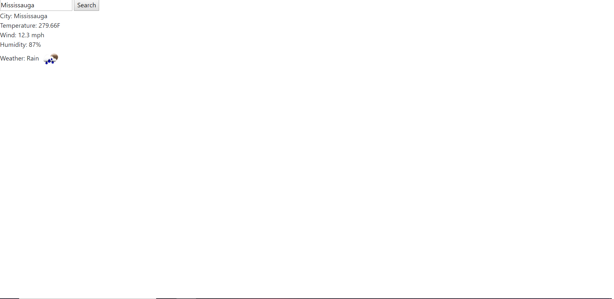

# Weather
This is Weather Dashboard here you can search any city and it will give result with Temperature,Wind,Humidity,Weather.

## Installation
Git clone the repo on your local computer and open Index.html or use this link below

https://irtzmalik.github.io/Weather/

## Usage 
Go to Index.html or https://irtzmalik.github.io/Weather/

Type City

Press Search

Result

